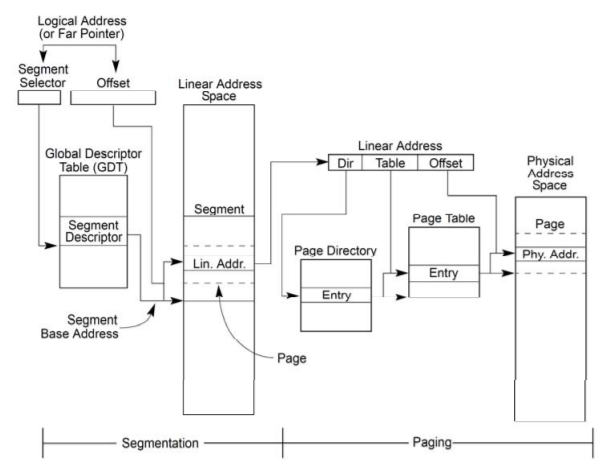

# Linux内存管理 #
## Intel体系架构下内存规范

- 地址过程：逻辑地址--> 线性地址-->物理地址

- 4个内存管理寄存器：GDTR、LDTR、IDTR和TR

## 内存管理各个阶段
### 启动阶段
### 解压内核阶段
### 运行阶段

	             CPU                  CPU                  Bus
	           Virtual              Physical             Address
	           Address              Address               Space
	            Space                Space
	
	          +-------+             +------+             +------+
	          |       |             |MMIO  |   Offset    |      |
	          |       |  Virtual    |Space |   applied   |      |
	        C +-------+ --------> B +------+ ----------> +------+ A
	          |       |  mapping    |      |   by host   |      |
	+-----+   |       |             |      |   bridge    |      |   +--------+
	|     |   |       |             +------+             |      |   |        |
	| CPU |   |       |             | RAM  |             |      |   | Device |
	|     |   |       |             |      |             |      |   |        |
	+-----+   +-------+             +------+             +------+   +--------+
	          |       |  Virtual    |Buffer|   Mapping   |      |
	        X +-------+ --------> Y +------+ <---------- +------+ Z
	          |       |  mapping    | RAM  |   by IOMMU
	          |       |             |      |
	          |       |             |      |
	          +-------+             +------+
## 概念 ##
### node节点 ###

	typedef struct pglist_data {

### zone内存域 ###

	struct zone {

## 进程地址空间 ##

## 分配非连续内存块vmalloc机制 ##

## slub分配器 ##

## slob分配器 ##

## slab分配器 ##
### kmem_cache_create，创建slab对象 ###
### kmem_cache_alloc，申请 ###
### kmem_cache_free，释放 ###

## 伙伴系统分配 ##
### alloc_pages，申请页面返回页面地址 ###
### page_address，页面地址转内存地址 ###

## swap交换区 ##
1. 内核中涉及swap交换区的数据结构struct swap\_info\_struct *swap\_info[MAX_SWAPFILES]; //MAX_SWAPFILES大致为32

## glibc内存管理（用户空间）

## 系统级内存
cat /proc/meminfo

	MemTotal: 所有可用RAM大小（即物理内存减去一些预留位和内核的二进制代码大小）
	MemFree: LowFree与HighFree的总和，被系统留着未使用的内存
	Buffers: 用来给文件做缓冲大小
	Cached: 被高速缓冲存储器（cache memory）用的内存的大小（等于 diskcache minus SwapCache ）.
	SwapCached:被高速缓冲存储器（cache memory）用的交换空间的大小
	已经被交换出来的内存，但仍然被存放在swapfile中。用来在需要的时候很快的被替换而不需要再次打开I/O端口。
	Active: 在活跃使用中的缓冲或高速缓冲存储器页面文件的大小，除非非常必要否则不会被移作他用.
	Inactive: 在不经常使用中的缓冲或高速缓冲存储器页面文件的大小，可能被用于其他途径.
	HighTotal:
	HighFree: 该区域不是直接映射到内核空间。内核必须使用不同的手法使用该段内存。
	LowTotal:
	LowFree: 低位可以达到高位内存一样的作用，而且它还能够被内核用来记录一些自己的数据结构。Among many
	other things, it is where everything from the Slab is allocated. Bad things happen when you’re out of lowmem.
	SwapTotal: 交换空间的总大小
	SwapFree: 未被使用交换空间的大小
	Dirty: 等待被写回到磁盘的内存大小。
	Writeback: 正在被写回到磁盘的内存大小。
	AnonPages：未映射页的内存大小
	Mapped: 设备和文件等映射的大小。
	Slab: 内核数据结构缓存的大小，可以减少申请和释放内存带来的消耗。
	SReclaimable:可收回Slab的大小
	SUnreclaim：不可收回Slab的大小（SUnreclaim+SReclaimable＝Slab）
	PageTables：管理内存分页页面的索引表的大小。
	NFS_Unstable:不稳定页表的大小
	VmallocTotal: 可以vmalloc虚拟内存大小
	VmallocUsed: 已经被使用的虚拟内存大小。
	VmallocChunk: largest contigious block of vmalloc area which is free

## 进程级内存
cat /proc/pid/smaps

## 资料
http://duartes.org/gustavo/blog/post/anatomy-of-a-program-in-memory/