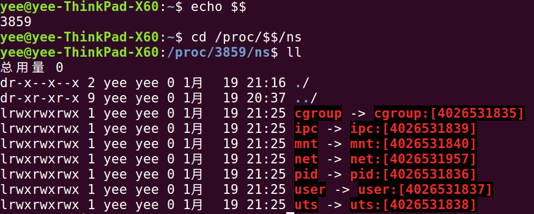
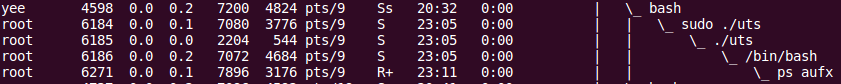
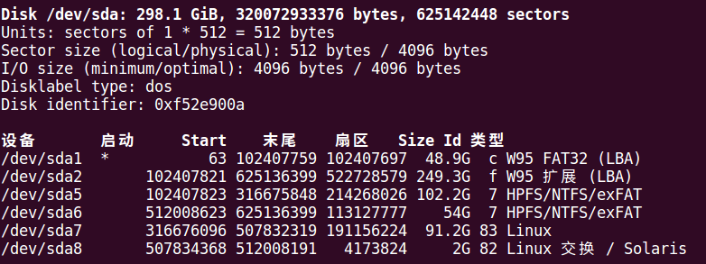
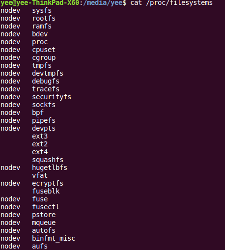
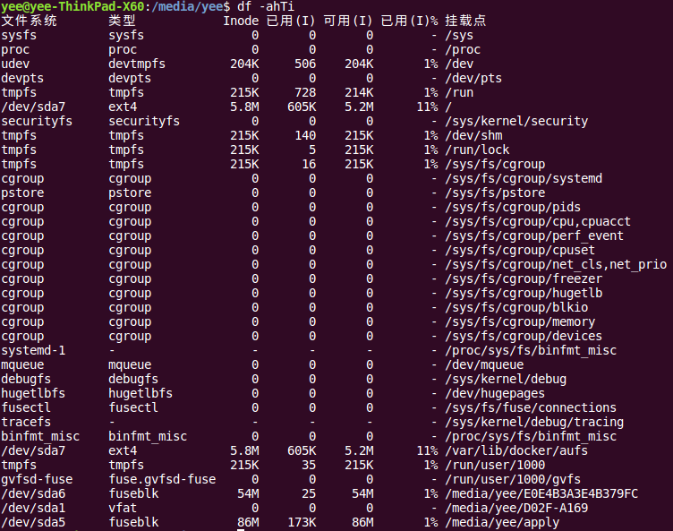
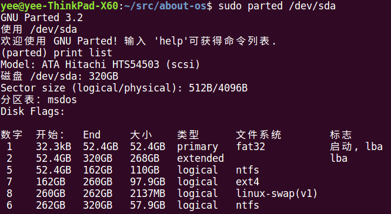

# Linux容器技术 #
Docker是虚拟化的一种轻量级替代技术。Docker的容器技术不依赖任何语言、框架或系统，可以将App变成一种标准化的、可移植的、自管理的组件，并脱离服务器硬件在任何主流系统中开发、调试和运行。

## 容器核心技术 ##
- namespaces命名空间 - *提供环境的隔离*
- cgroups控制组 - *提供资源的隔离*
- AUFS层状文件系统 - *提供文件系统的隔离*

## namespaces命名空间 ##
### 空间类型 ###
1. UTS - CLONE_NEWUTS,命名空间间hostname主机名隔离,始于Linux2.4.19
1. IPC - CLONE_NEWIPC,隔离System V IPC objects和POSIX message queues,始于Linux2.6.19
1. PID - CLONE_NEWPID，命名空间间的进程PID隔离，始于Linux2.6.24
1. NS - CLONE_NEWNS，挂载点隔离，始于Linux2.4.19
1. NET - CLONE_NEWNET，网络隔离，始于Linux2.6.29
1. USER - SCLONE_NEWUSER，虚拟user-id映射到真实的user-id，始于Linux3.8

### 系统调用 ###
1. clone() - 在新namespace中创建新进程
1. unshare() - 进程脱离某个namwspace
1. setns() - 进程加入某个namespace

### proc文件系统 ###

*通过proc文件系统可以查看对namespace及cgroup的支持程度及相关**ID**,这个ID很重要，唯一标识命名空间及cgroup组，用户程序也使用ID*

### 用户程序 ###
1. unshare
1. nsenter
1. hostname - uts工具
1. ipcmk - ipc工具，用于创建共享内存、消息队列、信号量ipc资源
1. ipcs - ipc工具，与ipcmk配套用于查询ipc资源

### 实验 ###
#### UTS命名空间 ####

#### IPC命名空间 ####
##### IPC类型 #####
1. 管道 - 进程
1. FIFO - 进程
1. UNIX domain socket - 进程
1. Internet domain socket - 进程
1. System V消息队列 - 内核（全局）
1. System V信号量 - 内核（全局）
1. System V共享内存 - 内核（全局）
1. POSIX消息队列 - 内核（全局）
1. POSIX命名信号量 - 内核（全局）
1. POSIX无名信号量 - 内核 or 进程
1. POSIX共享内存 - 内核（全局）
1. 匿名映射 - 进程
1. 内存映射文件 - 文件系统
1. flock锁 - 进程
1. fcntl锁 - 进程
*内核（全局）范围归IPC命名空间隔离*

#### mount命名空间 #####
##### 支持的文件系统、挂接情况 #####

*包含windows分区，文件系统机制，请参考*[Linux文件系统](./Linux文件系统.md)

## cgroups控制组 ##
### cgroups文件系统 ###
### cgroups子系统 ###
1. cpu子系统，限制进程的cpu使用率
1. cpuacct子系统，cpu使用报告
1. cpuset子系统，分配单独的cpu节点或者内存节点
1. memory子系统，限制memory使用量
1. blkio子系统，限制块设备io
1. devices子系统，控制进程访问某些设备
1. net_cls子系统，标记网络数据包，然后可以使用tc模块traffic control对数据包进行控制
1. freezer子系统，挂起或者恢复cgroups中的进程
1. ns子系统，不同cgroups下面的进程使用不同的namespace

## AUFS层状文件系统 ##
