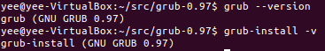
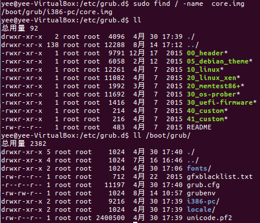

# Linux引导过程 #
## 第一个程序 - bootloader
### GRUB Legacy
#### 核心镜像core.img、配置grub.cfg及配套工具

## 编译内核
	apt-get source linux-image-$(uname -r)		#下载当前版本内核
## vmlinuz可引导的、压缩的内核（vmlinux未压缩）
	make zImage		#小内核，自带gzip解压代码，老的zImage解压缩内核到低端内存(第一个640K)
    make bzImage	#大内核，自带gzip解压代码，bzImage解压缩内核到高端内存(1M以上)
## initrd.img
## System.map内核符号表
	cat /boot/System.map | grep do_fork		#查看do_fork地址
## 初始化系统 - sysvinit
- service

        service 服务名 start/stop/status... #/etc/init.d/服务文件脚本（服务名）

- chkconfig

## 初始化系统 - systemd
## 内核信息
	cat /proc/cmdline
	cat /proc/kallsyms

## 启动参数
- 搜索__setup(

## 启动流程
- struct task\_struct init\_task = INIT\_TASK(init_task);
- union thread\_union init\_thread_union \_\_init\_task\_data = { INIT\_THREAD\_INFO(init\_task) };

- start\_kernel
	- parse\_early_param
	- parse_args
	- init_IRQ，硬中断初始化
	- init_timers，定时器初始化
	- softirq_init，软中断初始化
	- proc_root_init，初始化proc文件系统，详见[Linux文件系统](Linux文件系统.md)
		- proc_net_init
	- rest_init
		1. kernel\_thread(**kernel\_init**, NULL, CLONE_FS)，创建PID=1的进程
			- kernel\_init_freeable
				- **do\_basic_setup**
					- cpuset\_init_smp
					- shmem\_init
					- driver\_init
					- init\_irq_proc
					- do\_ctors
					- usermodehelper\_enable
					- do\_initcalls，调用"__init"区函数
					- random\_int\_secret_init
			- free\_initmem，释放初"__init"区函数内存
			- run\_init_process，启动init=引导选项指定程序或按特定位置“/sbin/init”、"/etc/init"程序，PID为1
		2. kernel\_thread(kthreadd, NULL, CLONE\_FS | CLONE_FILES)，创建PID=2的进程
