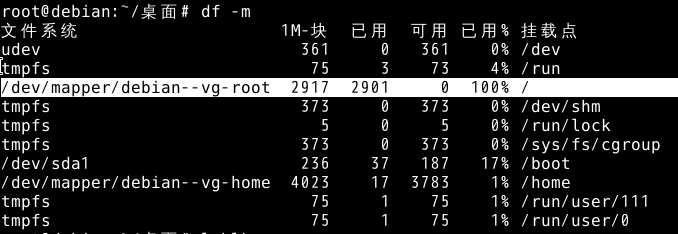
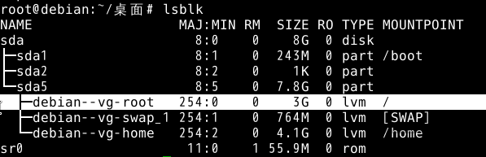
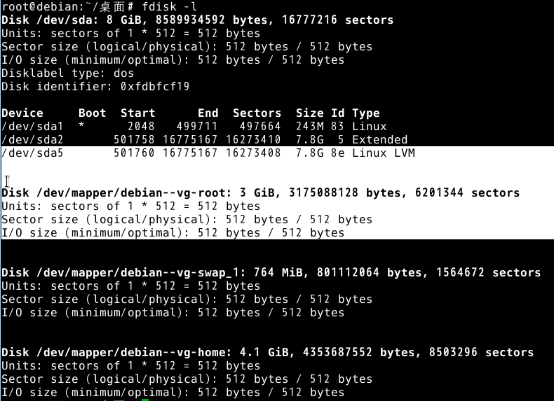
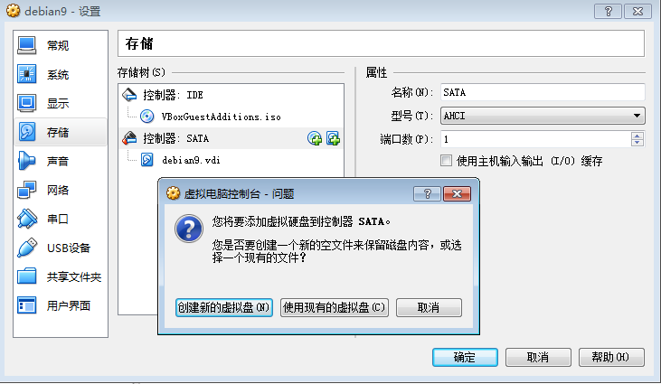
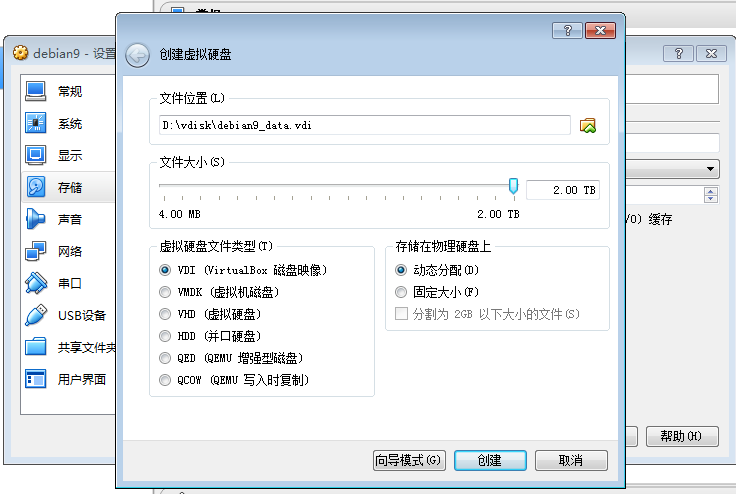
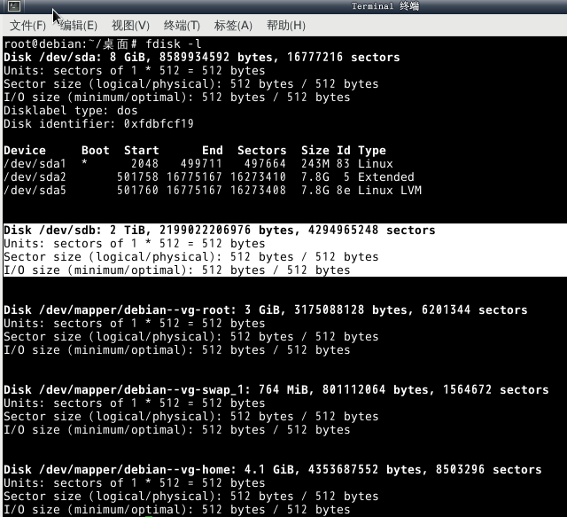
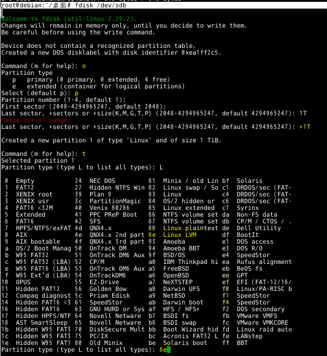
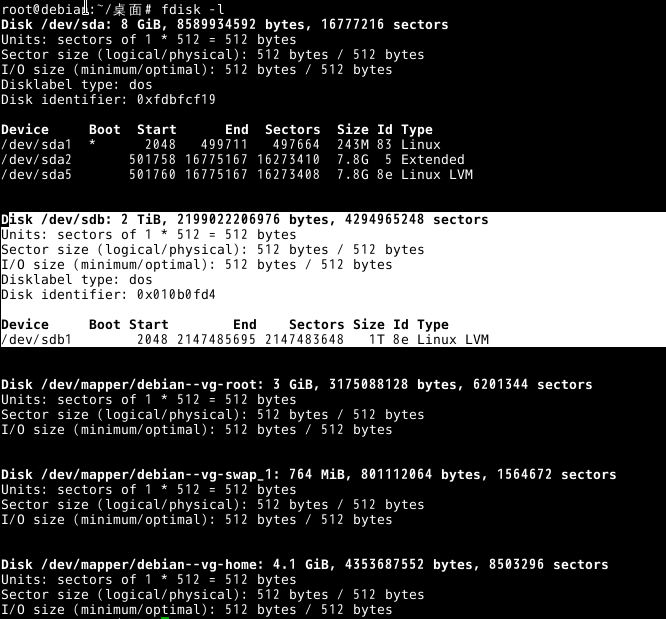
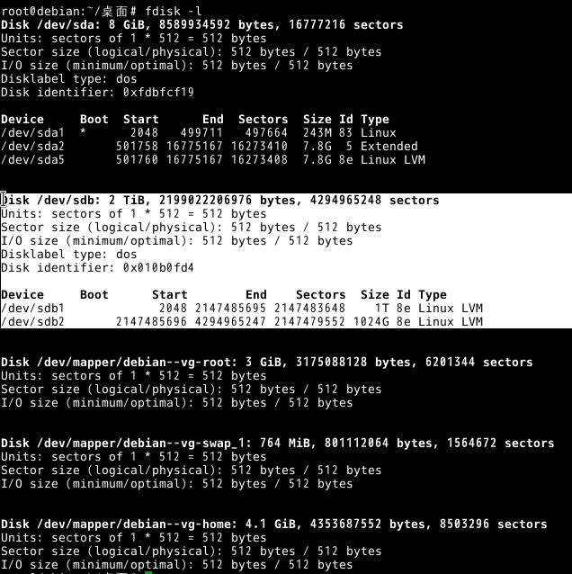

# Linux磁盘管理 #

## 根目录/扩容(LVM) ##
	du -m #查看文件系统及挂载点(文件系统列：内存文件系统/物理分区/逻辑卷)，根目录/空间为0，对应的是lvm逻辑卷，可以扩容

	lsblk #查看物理分区及lvm逻辑卷，树形结构

    fdisk -l #查看磁盘、物理分区及lvm逻辑卷

	加一块2T新硬盘，这里用virtualbox来模拟，实际情况类似

	fdisk -l #新增的2T新硬盘/dev/sdb，已经被OS识别

	fdisk /dev/sdb
	step1:n    #创建物理分区
    step2：p   #一个磁盘只能创建4个主分区，这里划分成2个分区，分别给/和/home扩容,选择主分区够了
    step3：+1T #选择1T大小
    step4：t   #更改分区类型，L查看所有类型
    step5：8e  #8e为linux lvm
	step6：w   #保存并写入

	fdisk -l   #再次确认结果

	fdisk /dev/sdb #对sdb剩余磁盘空间，创建新的lvm逻辑卷，步骤同上
	fdisk -l       #确认结果

---

	至此，磁盘分区已经创建完成。开始自下而上创建逻辑卷

