# Linux网络管理 #

## 网络协议 ##
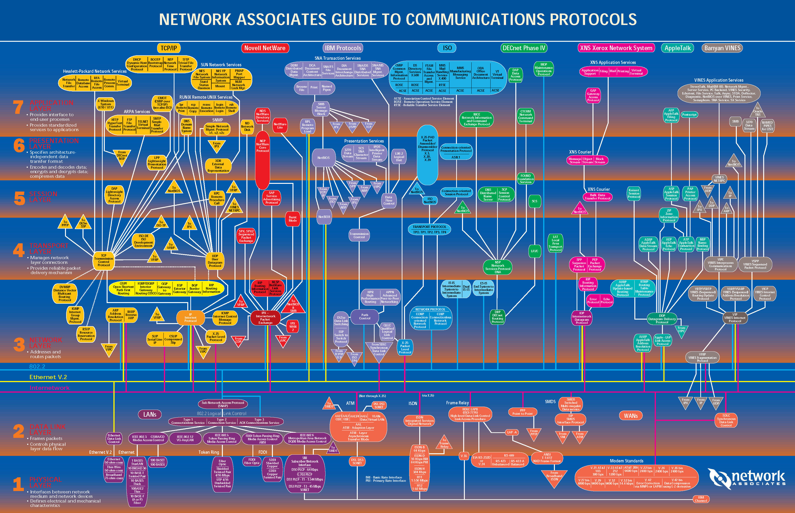

## Linux网络实现及数据流 ##

## Linux网络IO模型 ##
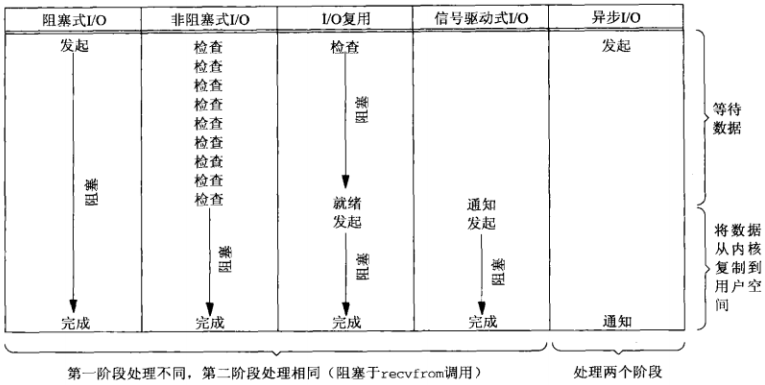

## 网络协议栈各部分初始化 ##
- **core_initcall：sock\_init初始，网络协议运行环境初始化,即套接口层初始化**
	- net\_sysctl\_init，初始化网络相关系统控制参数sysctl，机制部分详见[Linux系统控制参数sysctl](Linux系统控制参数sysctl.md)
	- skb_init，创建socket buffer slab缓存
	- init_inodecache，创建socket伪文件系统的inode缓存sock_inode_cachep
	- register_filesystem，注册socket文件系统sockfs
	- kern_mount，挂载sockfs文件系统
	- ptp_classifier_init
- **fs\_initcall：inet\_init，Internet协议族的初始化**
	- (void)sock_register(&inet_family_ops)，注册Internet协议族，放入全局net\_families，socket系统调用会利用inet\_family\_ops->create来创建socket句柄和内部sock对象
- **subsys\_initcall：net\_dev_init，网络设备处理层的初始化**
	- dev\_proc_init，
	- netdev\_kobject_init
	- register\_pernet_subsys
	- for\_each\_possible\_cpu
		- 初始化per\_cpu接收队列softnet\_data
- **device\_initcall：设备驱动初始化**

备注：core\_initcall/fs\_initcall等为初始化宏，级别越高越早初始化,详见[Linux引导过程](Linux引导过程.md)

## 系统调用层（net\socket.c） ##
	
- SYSCALL_DEFINE3(socket, int, family, int, type, int, protocol)
> family参数告诉系统使用哪个底层协议族。对TCP/IP协议族而言，该参数应该设置为PF_INET(IPv4)或PF_INET6(IPv6)；对UNIX本地域协议族，应设置为PF_UNIX；

> type参数指定服务类型。服务类型有SOCK_STREAM流服务、SOCK_UGRAM数据包服务、SOCK_RAW原始套接口服务；

> protocol参数用于指定具体的协议，通常在family和type选定之后，都默认指定了具体协议，所以只要填0即可；

> 备注：该系统调用在内部创建了sock对象、socket对象，file对象及fd

- sock_create
	- __sock\_create，创建socket对象和sock对象，sock封装在socket中返回
		- sock_alloc，创建socket对象
		- =============协议相关开始,以IPv4协议族为例============
		- 通过family or domain(协议族或协议域，应用层传入)从全局对象net\_families中找到net\_proto\_family对象（例如：IPv4协议族，AF\_INET,inet\_family_ops）
		- 调用net\_proto\_family.create创建sock对象（例如：IPv4协议族，实际调用inet_create）
			- sk_alloc，创建sock对象
			- inet_sk，sock对象转成子对象inet_sock对象
			- sock\_init\_data，初始化sock对象，并与socket对象建立关系
	- sock\_map_fd，把socket对象封装到file对象
		- fd_install，file对象映射到fd，并返回fd

## ICMPv4协议-因特网控制信息协议 ##
	
因特网主机间用于交换控制信息（主要是错误通知及信息请求）。ICMP协议本身相对比较简单，但对于确保系统正确的行为至关重要。ICMP消息类型比较多，使用场景比较复杂。

- ICMP初始化
	- sysctl\_ipv4\_init，初始化sysctl

---

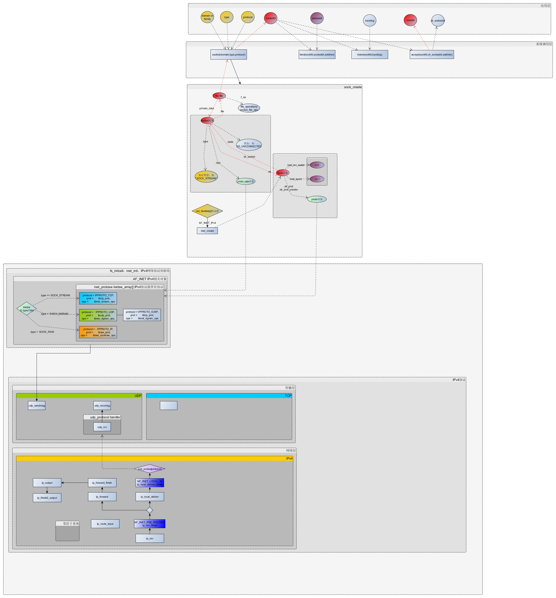

---
## 网络虚拟化 ##
### 网络命名空间，进程级资源隔离 ###
> 一种轻量级进程虚拟化机制，而非像KVM、XEN一样的OS级别虚拟化解决方案
	
- net\_ns_init
	- 系统默认init_net网络命名空间插入全局链表net_namespace_list尾部
- copy\_net_ns
	- net_alloc，创建新的网络命名空间net对象
	- 插入全局链表net\_namespace_list尾部

### cgroup，系统角度资源分配 ###
- net_prio
- cls_cgroup

## 网络设备 ##
### loopback回环设备 ###
- loopback_net_init，入参为网络命名空间（struct net *net），每个net中都有一个lo设备对象指针(struct *net_device )，该函数就是为lo设备对象分配内存，并让net和net_device建立双向联系，所谓双向联系就是net_device.loopback_dev -> lo对象，lo对象.nd_net.net -> 入参net
	- alloc_netdev，为“lo”网络设备分配内存，并设置setup安装函数，此处为loopback_setup
		- loopback_setup，lo设备的安装函数，用于设置net_device中的众多features、及ops等
			- dev->features = **NETIF_F_NETNS_LOCAL**，这类本地设备不能在不同的网络命名空间间转移，其他设备还有VXLAN，PPP，bridge设备，可以通过可以通过ethtool -k，或者ethtool --show-features查看该值
			- dev->ethtool_ops	= &**loopback_ethtool_ops**; 支持ethtool工具ops，loopback_ethtool_ops中只包含.get_link=always_on，always_on永远返回1，除此之外没有其他函数
			- dev->header_ops		= &eth_header_ops;
			- dev->netdev_ops		= &**loopback_ops**; lo网络设备ops
			- dev->destructor		= loopback_dev_free; 释放函数
			- dev_net_set，建立（lo对象.nd_net.net -> 入参net）联系
	- register_netdev，在net中注册设备对象
		- dev->netdev_ops->ndo_init(dev)， 如果存在netdev_ops->ndo_init则调用；lo设备可以查看struct net_device_ops loopback_ops中的**loopback_dev_init**

### e1000e网卡设备 ###
- e1000_init_module
	- pci_register_driver，注册pci驱动（pci_driver，e1000_driver)

### 网桥bridge ###

### 虚拟以太网卡veth ###
- veth_init
	- 
### TUN/TAP ###

### bonding ###

  bonding的模式一共有7种，常用的为0、1两种：

- round-robin(balance-rr)  0  网卡的负载均衡模式
- active-backup  1 网卡的容错模式
- balance-xor  2 需要交换机支持
- broadcast  3 广播模式
- ieee802.3ad  4 动态链路聚合模式，需要交换机支持
- mode-tlb  5 自适应模式
- mode-alb  6 网卡虚拟化方式

## 网络IO模型及编程 ##
- blocking 同步阻塞式I/O
	
	默认情况下,所有套接口都是阻塞的
		
	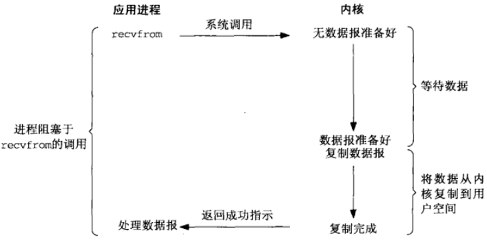

	单进程模型             |  多线程/进程模式 | 线程/进程池模式
	:-------------------------:|:-------------------------:|:-------------------------:
	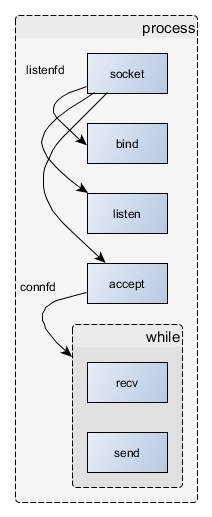  |  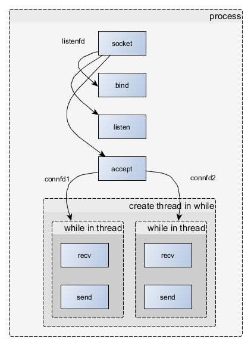 |  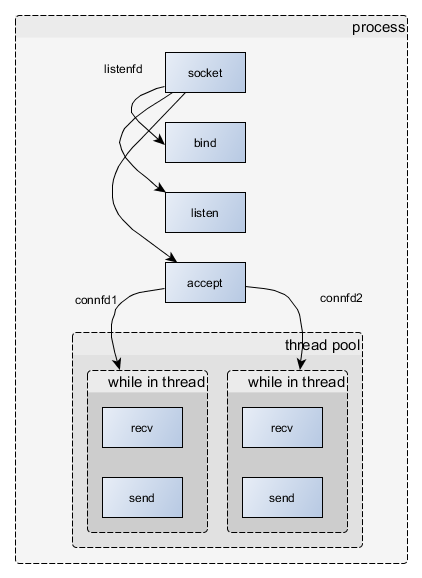

	1. 通过多线程/进程模式**解决了多连接阻塞问题**，连接用的accept函数在主进程中，把影响（指阻塞）accept的数据交互部分（recv和send）移到子线程/进程中，这样就不会阻塞连接也不会阻塞其他子线程/进程收发数据，是一种被动规避方案
	2. 多线程/进程模式下，虽然一定程度上解决了连接问题，但大量连接情况下会导致大量的线程/进程开销
	3. 线程/进程池模式，解决在一定程度上解决了连接问题和开销问题，但同样存在“池”大小选择问题，过大过小都不合适
	4. 上面两种模式，线程/进程中没有使用非阻塞I/O，因为没有必要

- nonblocking 同步非阻塞式I/O

	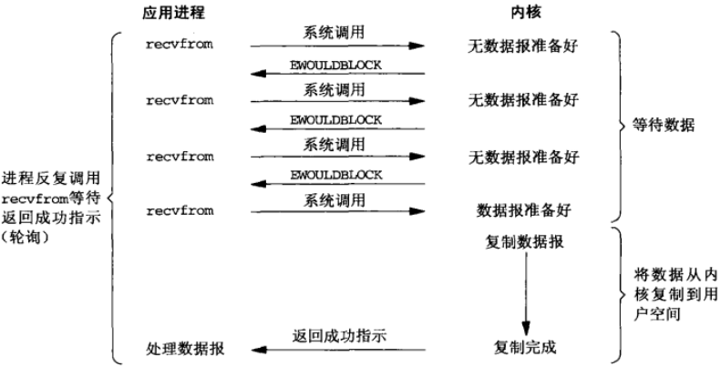

- multiplexing I/O多路复用(select/poll/epoll)

	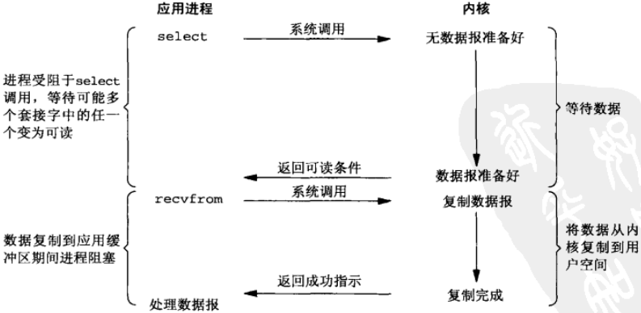

- signal driven 信号驱动式I/O(SIGIO)

	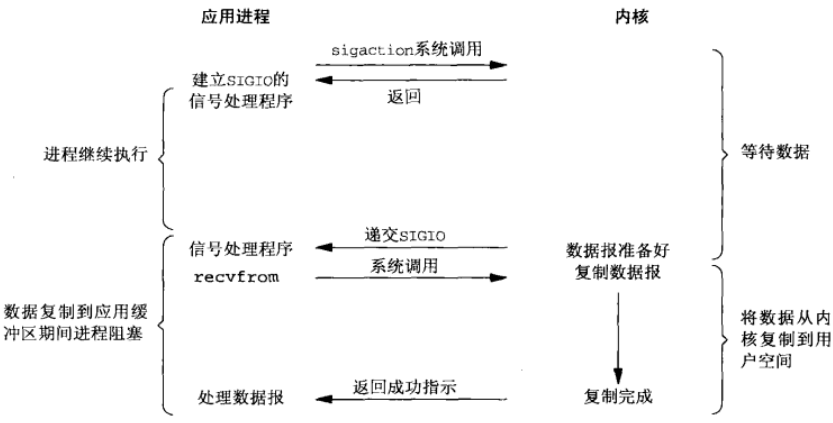

- asynchronous 异步I/O(POSIX的aio_系列函数)

	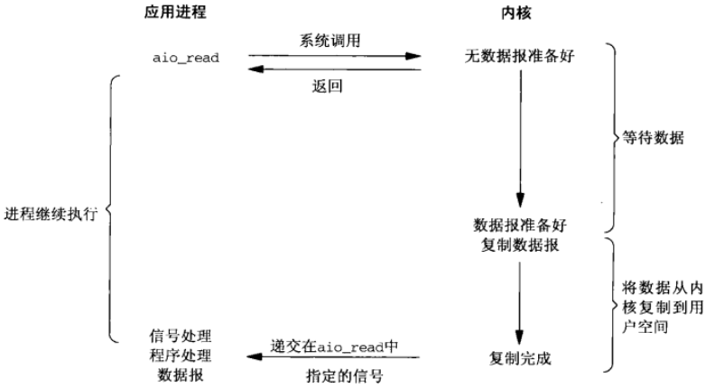

## 管理工具 ##
- ifconfig
- ethtool
- iwconfig
- tcpdump
- netstat
- ping
- hostname
- ip
