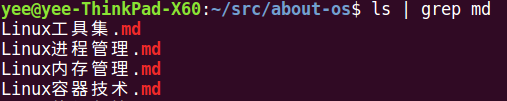

# Linux进程间通信 #

1. 管道 - 进程
   
    pipe是第一个广泛使用的IPC形式，可以在程序中使用，也可以在shell中使用，缺点就是没有名字只能用于有亲缘关系的进程间通信，例如父子进程。
    
    
   
1. FIFO - 进程
1. UNIX domain socket - 进程
1. Internet domain socket - 进程
1. System V消息队列 - 内核（全局）
1. System V信号量 - 内核（全局）
1. System V共享内存 - 内核（全局）
1. POSIX消息队列 - 内核（全局）
1. POSIX命名信号量 - 内核（全局）
1. POSIX无名信号量 - 内核 or 进程
1. POSIX共享内存 - 内核（全局）
1. 匿名映射 - 进程
1. 内存映射文件 - 文件系统
1. flock锁 - 进程
1. fcntl锁 - 进程