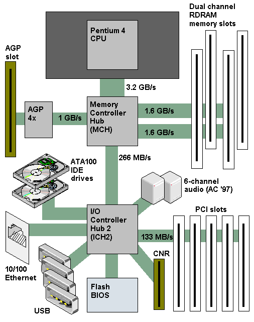
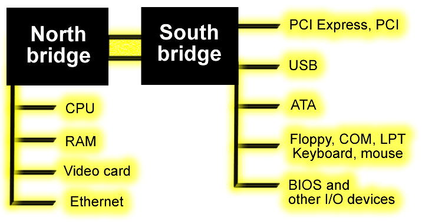
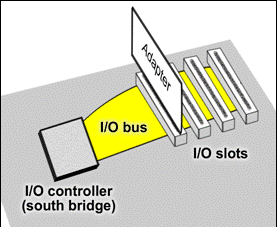
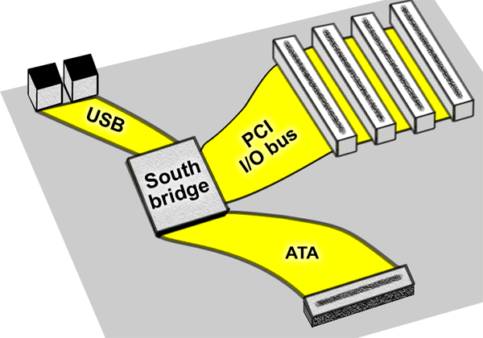
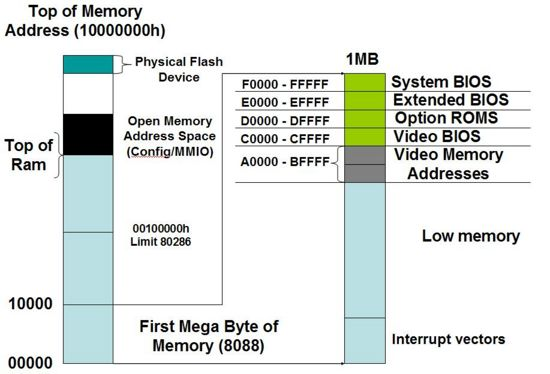
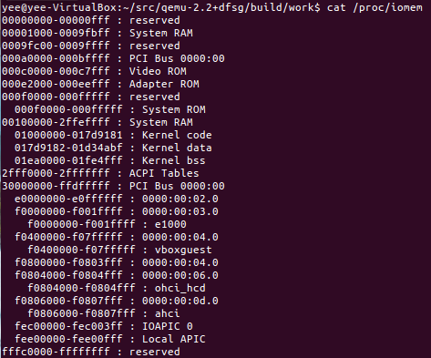
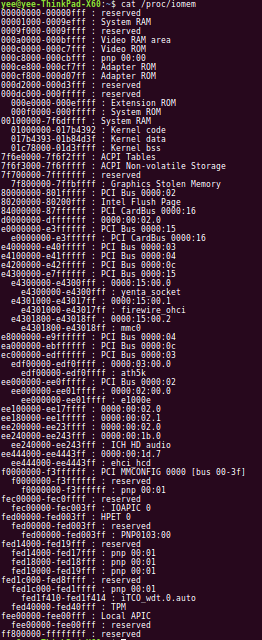
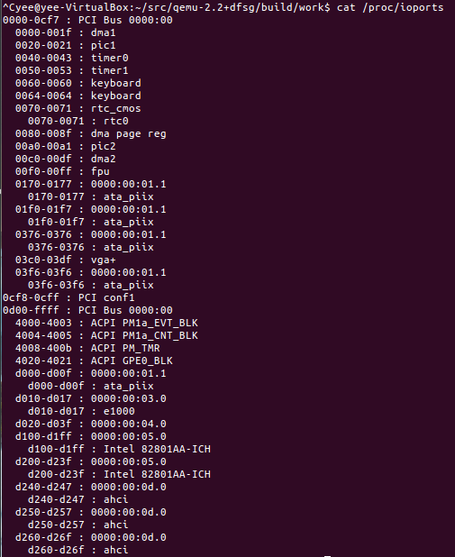
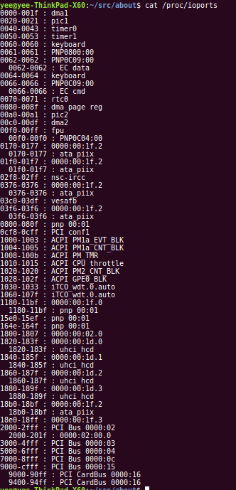

# 有关Qemu #

##qemu用户级仿真，能够运行那些为不同处理器编译的Linux程序

##qemu系统级仿真，仿真同构与非同构处理器及其他外部设备，运行完整的操作系统 
###PC体系结构介绍

   

   

   

   

- CPU仿真

- 内存仿真

- PC体系结构内存地址空间

   

    VM环境

    真实机器

- PC体系结构IO地址空间(64KB)

    VM环境

    真实机器

端口方位|硬件|文件
------------- | ------------- | ------------- |
0x40  -- 0x47 |可编程间隔定时器PIT芯片(8253/8254芯片)||
0x170 -- 0x177|IDE硬盘控制器1||
0x1F0 -- 0x1F7|IDE硬盘控制器0||
0x3F0 -- 0x3F7|软盘控制器||
APM|||
ACPI|APM_CNT_IOPORT（0xb2）,0xb100,0xafe0,0xae00,0xae08|(hw/acpi_piix4.c)

- Softmmu

- IRQ中断仿真

- PS/2键盘和鼠标

	PS/2协议支持两种设备，一种是键盘，一种是鼠标，它是由IBM公司制定的。根据PS/2协议，鼠标是由键盘的控制器(i8042)进行控制的，键盘控制器（i8042）总共有两个通道，一个通道由键盘使用，另一个通道由鼠标使用，我们对鼠标进行操作也是通过i8042芯片来完成的。i8042支持两种工作模式——AT模式及PS/2模式，与i8042有关的I/O端口共有两个，一个是0x60端口，一个是0x64端口

- VGA
- 硬盘
- USB
- 网卡

###仿真流程

1. 配置阶段

		x86_cpu_common_class_init，★设置与x86 cpu相关的一系列函数，
			|dc->realize -> x86_cpu_realizefn，★初始化cpu
								|qemu_init_vcpu，☆
									|kvm_enabled,
									|tcg_enabled,
						
2. 初始化阶段
   
	

		global：init_type_list数组，共4个元素MODULE_INIT_BLOCK、MODULE_INIT_OPTS、MODULE_INIT_QAPI、MODULE_INIT_QOM，每个元素代表不同类型对象或模块，每个元素挂接一个队列，队列中存放不同具体模块（qemu是一个oop，任何东西都是模块，包括非设备、选项、块设备、...）的初始化函数
		
		.init:通过4个宏block_init、opts_init、qapi_init、type_init把模块初始化函数注册到init_type_list数组中，等待后续调用。
			
		vl.c:main
				|
				|qemu_init_cpu_loop
					|qemu_init_sigbus,初始化qemu自身的信号
					|qemu_cond_init，初始化4个条件变量（qemu_cpu_cond、qemu_pause_cond、qemu_work_cond、qemu_io_proceeded_cond），用于控制qemu自身状态
					|qemu_mutex_init，初始化一个互斥量（qemu_global_mutex）
					|qemu_thread_get_self，设置一个线程函数（io_thread）
				
				|qemu_mutex_lock_iothread
	
				|module_call_init(MODULE_INIT_QOM)，module_call_init是调用模块初始化函数，此处对象模型初始化
					|其中一个是CPU模块初始化：x86_cpu_register_types
						type_register_static(&x86_cpu_type_info)，注册了x86 CPU类型，x86_cpu_type_info中包含了CPU各种特性，★如果设置了预编译宏CONFIG_KVM，则注册为host_x86_cpu_type_info；★不同type_info,其.class_init和.instance_init比较重要，对应不同函数 
	
				|module_call_init(MODULE_INIT_OPTS)，选项对象初始化
	
				|bdrv_init_with_whitelist
					|module_call_init(MODULE_INIT_BLOCK),调用块设备对象初始化
	
				|if defconfig=true，从userconfig加载默认参数到vm_config_groups中
				
				|for(;;){
					//根据参数，选择性初始化模块
					|kvm分支：case QEMU_OPTION_enable_kvm：
					
					|tcg分支：case QEMU_OPTION_no_kvm:
	
					|xen分支：case QEMU_OPTION_xen_domid
						
				 }
	
				|cpu_exec_init_all
					|io_mem_init，初始化IO端口
					
					|memory_map_init，初始化整个系统总线线性地址空间和io地址空间
						|申请并初始化了一块名为“system”的MemoryRegion，放到全局变量address_space_memory（代表线性地址空间）中
						|申请并初始化了一块名为“io”的MemoryRegion，address_space_io（代表io地址空间）中
	
				|socket_init，初始化qemu通信socket
	
				|machine_class->init(current_machine);
	
				|machine_usb，初始化usb设备
	
				|qemu_run_machine_init_done_notifiers
		

3. 执行阶段

		qemu_tcg_cpu_thread_fn，线程
			|while(1)
				|tcg_exec_all
					|tcg_cpu_exec
						|cpu_exec，☆
							|CPU_GET_CLASS宏，获取cpu类型
							|tcg_current_cpu，设置全局
							|cc->cpu_exec_enter，调用多态函数，实际调用跟体系结构相关的函数，如果是x86，调用的是x86_cpu_exec_enter函数
							|for(;;)
								|tb_find_fast，查找指令
									|tb_find_slow，指令不在TB中，执行此处
										|translate-all.c:tb_gen_code，☆翻译指令
											|target-xxx\translate.c:gen_intermediate_code，★Guest Code -> TCG IR
											|tcg_gen_code，☆TCG IR -> Host Code
								|cpu_loop_exec_tb，执行指令
									|cpu_tb_exec
									|cpu_exec_nocache
										|tb_gen_code

###具体设备

- CPU仿真

- 内存仿真

		GPA：guest physical address
		HVA：host virtual address
		
				0			  		 		4G							64G
		system	|------|------|------|------|------|------|------|------|
				[    pc.ram   ]
				[         ram-below-4g     ][         ram-above-4g      ]        

- PCI总线仿真

		#初始化阶段
		pc_machine_initfn
			DEFINE_I440FX_MACHINE
				|pc_init1
					|pc_memory_init，申请一块"pc.ram"的MemoryRegion，加载bios
					|pc_cmos_init，初始化cmos

- 鼠标键盘仿真

		#初始化阶段
		i8042_realizefn
			|注册IRQ，键盘IRQ1和鼠标IRQ12
			|注册IO端口，0x60和0x64

- VGA仿真和图形用户接口（Graphical User Interface）

		> Curses（Linux平台，local ui）
		> COOCA（OSX平台，local ui）
		> SDL（跨平台，local ui）
		  SDL是一个跨平台的多媒体库，它通过OpenGL和2D视频帧缓冲，提供了针对音频、视频、键盘、鼠标、控制杆及3D硬件的低级别的访问接口。*
	
		> GTK（Linux平台，local ui）
		> VNC（remote ui）
			#初始化阶段，参见“系统级仿真”初始化，需求定义CONFIG_VNC和参数“vnc”
			vnc_init_func
        > SPICE（remote ui）

##KVM半虚拟化
	#配置阶段
	kvm-all.c:kvm_accel_class_init，☆
		|ac->init_machine = kvm_init，
			|target-xxx\kvm.c:kvm_arch_init，★

	#执行阶段
	qemu_kvm_cpu_thread_fn，线程

##XEN半虚拟化
	#执行阶段
	qemu_kvm_cpu_thread_fn，线程

##其他
###命令行选项,参见qemu-options.hx
-m
-machine accel=
-device \?
###QMP监控，参见qapi-schema.json和qmp目录下python脚本
*JSON RPC-like API for managing QEMU:*

- Hotplug devices
- Stop/continue guest
- Query device information

###HMP监控，参见hmp-commands.hx
*Text-based interface for managing QEMU*

