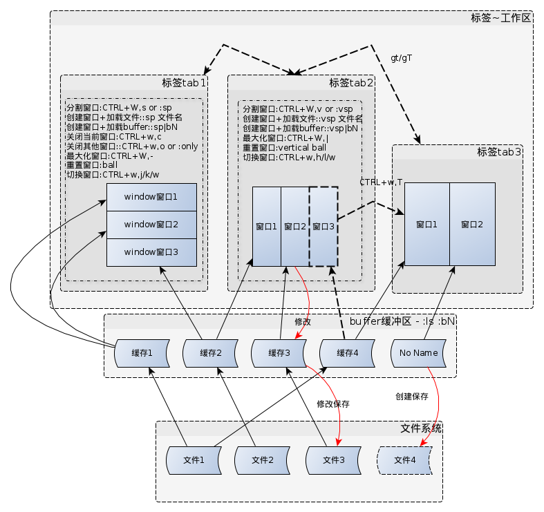

#vim设计

---------

##文本层 - 基本配置

buffer,window,tab关系

###buffer
  * buffer创建
  * buffer删除或关闭,:bd
  * buffer切换
  * buffer焦点

###window
  * window创建
  * window删除或关闭
  * window重排
  * window切换,ctrl+w w
  * window最大化,ctrl+w |/_

###tab
  * tab创建
  * tab删除或关闭
  * tab重排
  * tab获取焦点

###移动光标

###文件内搜索 - 移动光标的一种方式
  * ?word or /word直接搜索, 快捷方式*
  * [I搜索结果,放入窗口
  * :set hlsearch配置高亮
  * :set ignorecase配置忽略大小写
  * :set smartcase配置智能搜索
  * :set incsearch配置递进搜索
  * :set wrapscan配置环形搜索
  * ctrl+r ctrl+w获取当前光标下的word

###编辑文字

####拷贝

####删除

####粘帖

###替换 - 编辑文字的一种方式

###折叠
  * zc,折叠
  * zo,张开

###主题管理

##语义层 - 按IDE标准来设计,不同语言会有所不同

###项目管理

####文件管理

###项目搜索

###补全

##快捷键管理
